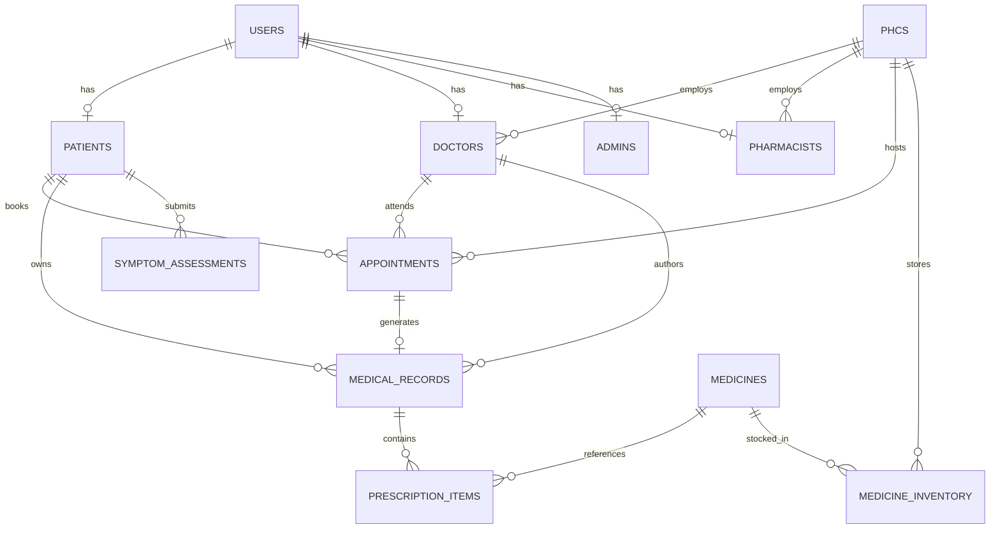

# PHC Connect (ArogyaMitra) – Database Schema

## Relational Data Model (PostgreSQL / Prisma ORM)

## Core Relational Tables & Attributes

### 1. `users`
- `id` (UUID, PK)
- `email` (VARCHAR, Unique)
- `phone` (VARCHAR, Unique)
- `passwordHash` (VARCHAR)
- `role` (ENUM: `PATIENT`, `DOCTOR`, `PHARMACIST`, `ADMIN`)
- `fullName` (VARCHAR)

### 2. `phcs`
- `id` (UUID, PK)
- `code` (VARCHAR, Unique, e.g. `PHC-DL-001`)
- `name` (VARCHAR)
- `type` (VARCHAR: `Urban PHC`, `Rural PHC`, `CHC`)
- `address`, `district`, `state`, `pincode`
- `latitude`, `longitude` (FLOAT, for GPS distance calculation)
- `phone`, `email`
- `openingHours` (VARCHAR)
- `emergencyServices` (BOOLEAN)
- `totalBeds` (INT)
- `departments` (JSON)

### 3. `patients`
- `id` (UUID, PK)
- `userId` (UUID, FK -> `users.id`)
- `patientId` (VARCHAR, Unique, e.g. `PHC-PAT-2026-0001`)
- `fullName`, `age`, `gender`, `phone`, `email`, `address`
- `emergencyContactName`, `emergencyContactPhone`, `emergencyContactRelation`
- `allergies` (JSON Array)
- `existingConditions` (JSON Array)
- `currentMedications` (JSON Array)

### 4. `doctors`
- `id` (UUID, PK)
- `userId` (UUID, FK -> `users.id`)
- `doctorId` (VARCHAR, Unique, e.g. `PHC-DOC-101`)
- `fullName`, `qualification`, `specialization`, `yearsOfExperience`
- `phcId` (UUID, FK -> `phcs.id`)
- `workingHours` (VARCHAR)
- `status` (ENUM: `AVAILABLE`, `BUSY`, `OFFLINE`, `ON_LEAVE`)

### 5. `appointments`
- `id` (UUID, PK)
- `appointmentNumber` (VARCHAR, Unique, e.g. `APT-2026-0001`)
- `patientId` (UUID, FK -> `patients.id`)
- `doctorId` (UUID, FK -> `doctors.id`)
- `phcId` (UUID, FK -> `phcs.id`)
- `date` (DATE)
- `timeSlot` (VARCHAR)
- `tokenNumber` (INT)
- `reasonForVisit` (TEXT)
- `criticalityLevel` (ENUM: `LOW`, `MEDIUM`, `HIGH`, `EMERGENCY`)
- `status` (ENUM: `Pending`, `Confirmed`, `Checked_In`, `In_Consultation`, `Completed`, `Cancelled`)

### 6. `medical_records` (EHR)
- `id` (UUID, PK)
- `recordNumber` (VARCHAR, Unique, e.g. `REC-2026-0001`)
- `patientId` (UUID, FK -> `patients.id`)
- `doctorId` (UUID, FK -> `doctors.id`)
- `phcId` (UUID, FK -> `phcs.id`)
- `appointmentId` (UUID, FK -> `appointments.id`)
- `visitDate` (DATE)
- `chiefComplaints` (JSON Array)
- `clinicalAssessment` (TEXT)
- `diagnosis` (JSON Array)
- `vitals` (JSON Object)
- `recommendedTests` (JSON Array)
- `followUpDate` (DATE)
- `referralType` (ENUM: `Patient_Treated`, `Follow_up_Required`, `Referred_to_Specialist`, `Emergency_Referral`)
- `doctorNotes` (TEXT)

### 7. `prescription_items`
- `id` (UUID, PK)
- `medicalRecordId` (UUID, FK -> `medical_records.id`)
- `medicineId` (UUID, FK -> `medicines.id`, Nullable)
- `medicineName` (VARCHAR)
- `genericName` (VARCHAR)
- `dosage` (VARCHAR)
- `frequency` (VARCHAR)
- `duration` (VARCHAR)
- `instructions` (TEXT)

### 8. `medicine_inventory`
- `id` (UUID, PK)
- `medicineId` (UUID, FK -> `medicines.id`)
- `phcId` (UUID, FK -> `phcs.id`)
- `quantity` (INT)
- `minimumStockLevel` (INT)
- `batchNumber` (VARCHAR)
- `expiryDate` (DATE)
- `supplier` (VARCHAR)
- `costPerUnit` (FLOAT)
- `status` (VARCHAR: `In Stock`, `Low Stock`, `Out of Stock`, `Expiring Soon`)

### 9. `medicine_transactions`
- `id` (UUID, PK)
- `medicineId` (UUID, FK -> `medicines.id`)
- `phcId` (UUID, FK -> `phcs.id`)
- `type` (ENUM: `DISPENSED`, `RESTOCKED`, `EXPIRED_DISPOSAL`)
- `quantity` (INT)
- `patientId`, `patientName`
- `dispensedBy` (VARCHAR)
- `batchNumber` (VARCHAR)
- `timestamp` (DATETIME)
